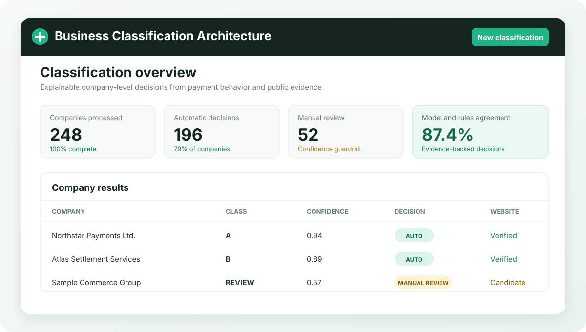

# AI-Driven Business Classification Architecture

Applied AI project for explainable business classification from bank payment operations

## Overview

This project developed an end-to-end architecture that converts XLSX or CSV payment data into company-level business classifications

The pipeline validates and groups transactions, builds behavioral features, combines deterministic rules with machine learning, verifies public website evidence, and routes uncertain decisions to human review through a local Django interface

## Scope of Work

The project included:

- multi-format payment ingestion and field validation
- company entity resolution using tax identifiers and account details
- behavioral and temporal feature engineering
- explainable rule-based scoring and saved ML model inference
- official website discovery and evidence validation
- confidence-based arbitration between automatic decisions and manual review
- local Django workflows for uploads, run monitoring and result inspection
- Excel, CSV and JSON result exports with manual overrides

## Repository Structure

- `src/fintech_classifier/` — ingestion, enrichment, features, models and classification pipelines
- `webapp/classifier_ui/` — Django interface for uploads, run monitoring and review
- `webapp/fintech_portal/` — Django project settings and routing
- `config/` — feature definitions and reference catalog configuration
- `requirements.txt` — project dependencies
- `pyproject.toml` — Python package metadata and CLI entry point

  

  <em>Preview of the AI-Driven Business Classification Architecture.</em>

## Materials

- [Feature catalog](config/feature_catalog.yaml)
- [Configuration template](.env.example)

## Status

Completed applied AI project
