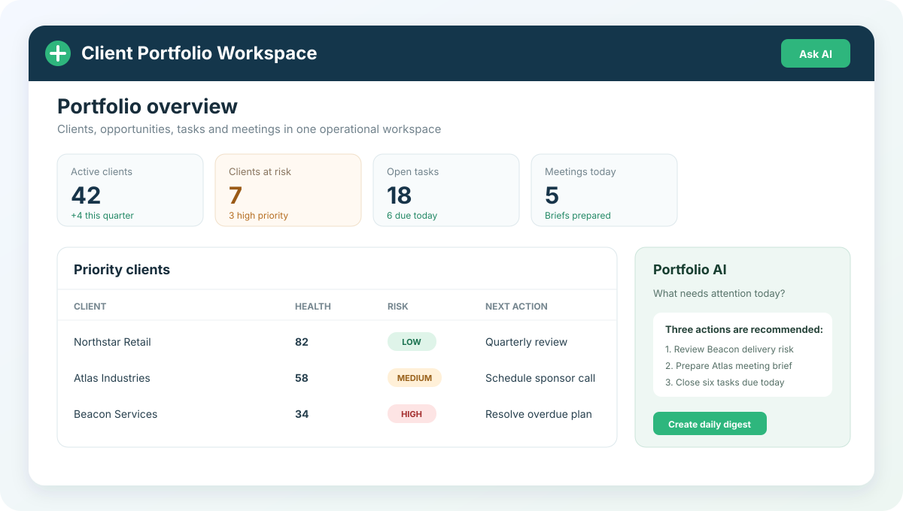

# AI Client Portfolio Management Workspace

Applied AI project for unified client portfolio operations, risk monitoring and manager assistance

## Overview

This project developed a local desktop workspace that brings client records, deals, projects, tasks, meetings, performance metrics and communications into one operational view

The system combines deterministic portfolio analytics with an AI assistant, voice input, client risk detection, daily digests, meeting briefs and exportable client reports

## Scope of Work

The project included:

- role-based workspaces for portfolio sponsors, managers and administrators
- unified client, deal, project, task and meeting management
- portfolio analytics and deviation monitoring
- explainable client risk scoring with recommended actions
- AI-assisted questions grounded in local portfolio context
- local voice transcription for hands-free input
- automated daily digests, reminders and background checks
- one-page client summaries, meeting briefs and PDF reports

## Repository Structure

- `src/ui/` — desktop interface, reusable components and application state
- `src/assistant/` — AI routing, context building and fallback responses
- `src/` — portfolio services, analytics, risks, persistence and permissions
- `templates/` — operational notifications, reminders and meeting briefs
- `scripts/` — database initialization and scheduled portfolio jobs
- `requirements.txt` — project dependencies
- `main.py` — desktop application entry point

  

  <em>Preview of the AI Client Portfolio Management Workspace.</em>

## Materials

- [Configuration template](.env.example)
- [Operational templates](templates/)

## Status

Completed applied AI project
