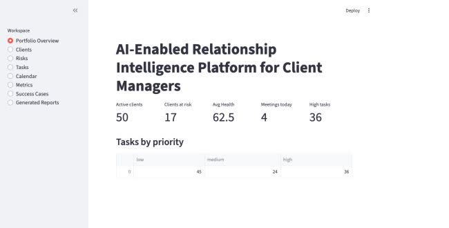
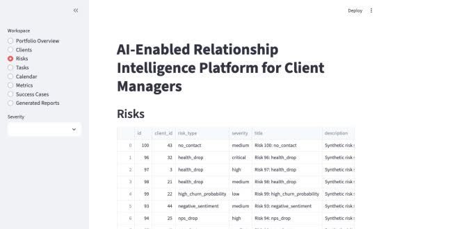
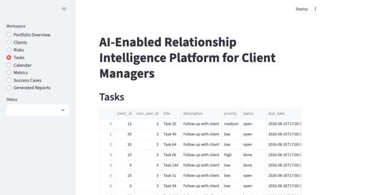
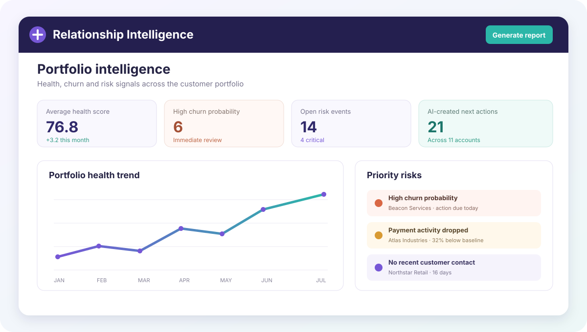

# AI-Enabled Relationship Intelligence Platform for Client Managers

Applied AI project for relationship intelligence, proactive client management and AI-assisted portfolio decisions

## Overview

This project developed an end-to-end platform that helps client managers monitor relationship health, identify churn risks, organize daily work and generate evidence-based recommendations

The system combines a FastAPI backend, Telegram workflows, a Streamlit dashboard, PostgreSQL with vector search, background jobs and a context-grounded AI agent

## Scope of Work

The project included:

- client portfolio, task, calendar and interaction management
- health score and churn probability estimation
- explainable risk detection with recommended actions
- automatic task creation for high-priority risk events
- AI-assisted portfolio questions grounded in stored client context
- Telegram workflows for clients, risks, reports and voice input
- Streamlit dashboards for metrics, risks, tasks and success cases
- scheduled daily and weekly digests
- reusable report, email, call-script and objection-handling templates

## Repository Structure

- `src/api/` — FastAPI application and portfolio endpoints
- `src/bot/` — Telegram handlers, keyboards and response formatting
- `src/dashboard/` — Streamlit portfolio and risk dashboards
- `src/ai/` — AI agent, context building, voice and report generation
- `src/risk/` — health scoring, churn estimation and risk monitoring
- `src/organizer/` — tasks, calendar, notifications and daily planning
- `src/knowledge/` — success-case retrieval and industry benchmarks
- `src/workers/` — scheduled monitoring and digest jobs
- `templates/` — reports, client messages and operational scripts
- `scripts/` — setup, data generation and scheduled job entry points

## Product Screens

   
  Portfolio overview — demo dashboard using synthetic data

   
  Risk workspace — demo dashboard using synthetic data

   
  Task workspace — demo dashboard using synthetic data

   
  Conceptual visual of the relationship-intelligence workflow

  <em>The three dashboard captures use synthetic demo data. The fourth visual is conceptual.</em>

## Materials

- [Configuration template](.env.example)
- [Local infrastructure](docker-compose.yml)
- [Communication templates](templates/)

## Status

Completed applied AI project
