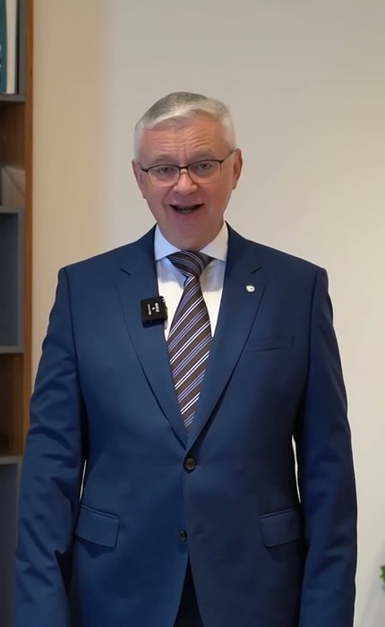

# AI Video Avatar Generation Bot

Applied AI project for creating avatar-led videos through a guided Telegram workflow

## Overview

This project developed a Telegram bot that turns text or voice input into short videos with configurable digital avatars

The system transcribes voice messages locally, prepares and edits scripts with GigaChat, normalizes the final text for speech, and generates videos with HeyGen after explicit user confirmation

## Scope of Work

The project included:

- Telegram bot workflows for greetings, team updates and news
- text and voice-based script preparation
- local speech recognition with faster-whisper
- GigaChat-based script generation and editing
- configurable HeyGen avatars and motion prompts
- script review before video generation
- SQLite-based draft history and generation status tracking

## Repository Structure

- `src/bot/` — Telegram bot handlers, keyboards and workflow states
- `src/services/` — GigaChat, HeyGen, speech recognition and text processing
- `src/database/` — database models and storage logic
- `src/prompts/` — LLM prompts for script generation and editing
- `config/` — avatar catalog and abbreviation settings
- `templates/` — motion prompts for avatar styles
- `assets/` — avatar preview videos
- `requirements.txt` — project dependencies
- `main.py` — application entry point

  

  <em>Preview of the AI Video Avatar Generation Bot project.</em>

## Materials

- [Avatar preview videos](assets/avatar_previews/)
- [Configuration template](.env.example)

## Status

Completed applied AI project
